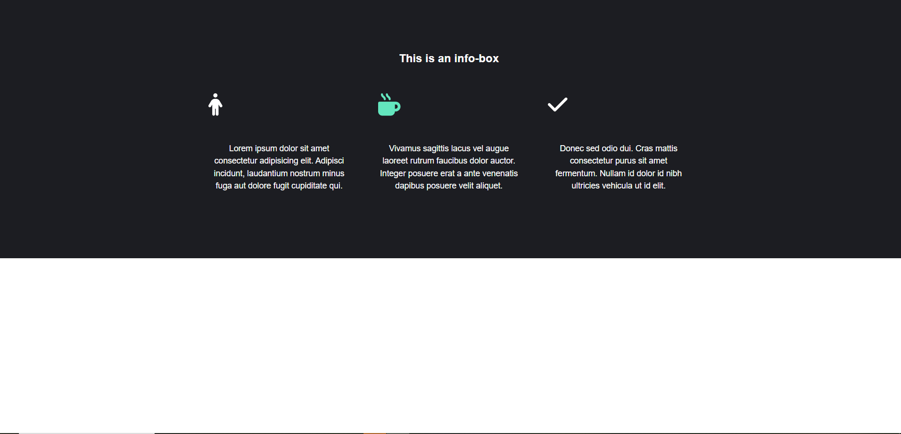

# Reto2.6

Nombre y Apellidos: Pablo Rodríguez Crespo
URL del repositorio de gitlab:

## Enunciado

**Objetivo**: Crear una caja informativa en el centro de la página que contenga tres bloques de texto con iconos, utilizando HTML y CSS. Además, agregar tres contenedores adicionales que se alineen en fila (uno al lado del otro) y se dispongan en columna cuando el ancho del dispositivo sea menor.

## Instrucciones

1. **Estructura HTML básica**:
   - Crea un archivo `index.html`.
   - Añade la estructura básica de HTML5 (`<!doctype html>`, `<html>`, `<head>`, y `<body>`).
   - En el `<head>`, agrega un título con tu nombre, y configura la codificación de caracteres como `UTF-8` con `<meta charset="UTF-8">`.
   - Incluye un enlace al kit de Font Awesome para poder usar sus iconos:
     ```html
     <script src="https://cdnjs.cloudflare.com/ajax/libs/font-awesome/6.6.0/js/all.min.js" integrity="sha512-6sSYJqDreZRZGkJ3b+YfdhB3MzmuP9R7X1QZ6g5aIXhRvR1Y/N/P47jmnkENm7YL3oqsmI6AK+V6AD99uWDnIw==" crossorigin="anonymous" referrerpolicy="no-referrer"></script>
     ```

2. **Contenido principal**:
   - Dentro del `<body>`, crea una estructura semántica, utilizando un contenedor `<div>` con la clase `.info-box`, que servirá como la caja informativa.
   - Dentro de la `.info-box`, añade un título con la etiqueta `<h2>`, el cual contendrá el texto "This is an info-box".
   - A continuación, crea otro contenedor con el `id="flex-p"` que almacenará tres párrafos de información (`<p>`), cada uno con la clase `big` y un icono al principio.
   - Cada párrafo deberá comenzar con uno de los siguientes iconos de Font Awesome:
     - ⭐ `fa-star`
     - 👍 `fa-thumbs-up`
     - ✔ `fa-check`
   - Después del icono, añade un breve párrafo de texto (puedes usar texto de relleno como Lorem Ipsum).

3. **Agregar contenedores flexibles**:
   - Después del contenedor `.info-box`, crea un nuevo contenedor `<div>` con el `id="flex-container"`.
   - Dentro de `#flex-container`, añade tres `<div>` adicionales con la clase `flex-item`. Cada uno de estos elementos contendrá un breve texto o algún contenido decorativo.
   - Estos tres contenedores se deben alinear en fila (uno al lado del otro) en pantallas anchas y reacomodarse en columna en dispositivos de menor ancho (utilizando media queries).

4. **Estilos CSS**:
   - Crea un archivo CSS separado (`styles.css`) e impórtalo en tu archivo HTML utilizando `<link rel="stylesheet" href="styles.css">`.
   - Define los siguientes estilos en el archivo CSS:
     - **Reset de márgenes y padding**: En el selector global (`*`), elimina los márgenes y padding predeterminados, y configura la fuente para todo el documento.
     - **Estilo de `.info-box`**: Aplica un color de fondo oscuro (#1C1D22), margen centrado, y relleno vertical.
     - **Alinear y distribuir contenido con Flexbox**: Establece que el contenedor `#flex-container` sea un contenedor flex, que centre los elementos y permita que se envuelvan.
     - **Contenedores flexibles en fila**: En el `#flex-container`, configura `display: flex` para que los elementos `.flex-item` se alineen en fila.
     - **Iconos**: Aumenta el tamaño de los iconos y añade un margen inferior para separar el icono del texto.

5. **Presentación final**:
   - Cuando termines, el resultado final deberá mostrar una caja informativa con un fondo oscuro, en el centro de la página, que contenga tres párrafos alineados en el centro, cada uno con un icono en la parte superior y el texto de relleno debajo.
   - Debajo de esta caja informativa, se deberá mostrar el `#flex-container` con tres contenedores en fila (que se dispongan en columna en dispositivos pequeños).

## Requisitos de entrega

- Entrega los archivos `index.html` y `styles.css`.
- Prueba la estructura en tu navegador para confirmar que el diseño cumple con los requisitos antes de entregar.

## imagen

